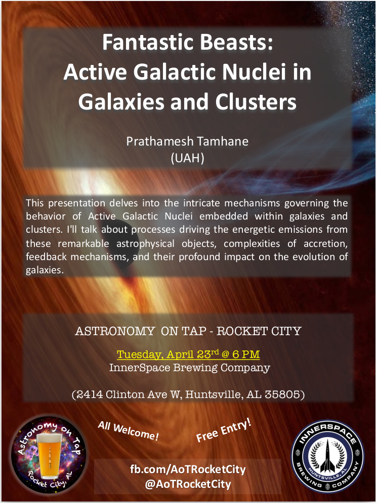

I had the pleasure of speaking at the [Astronomy on Tap]((https://astronomyontap.org/)) (AoT) event in [Huntsville](https://www.facebook.com/AoTRocketCity). AoT is a fantastic science outreach program that brings together astronomers and space enthusiasts in informal settings like bars, cafes, and similar venues. These events happen in cities all around the world, where local astronomers share talks, discussions, and presentations on various astronomy topics in a relaxed and engaging way that’s accessible to everyone, regardless of their background.

During my talk, I delved into the fascinating world of Active Galactic Nuclei (AGN). I explained what AGN are, what fuels them, their incredible power, and their significance in the evolution of galaxies. Towards the end of my presentation, I shared insights from my research on radio-mechanical AGN feedback in galaxy clusters. I also showcased some stunning images of radio galaxies and galaxy clusters across different wavelengths, which added a visual feast to the discussion.

It was an enjoyable experience to share my passion for astronomy with a diverse audience and to contribute to the vibrant AoT community.

Event poster:

