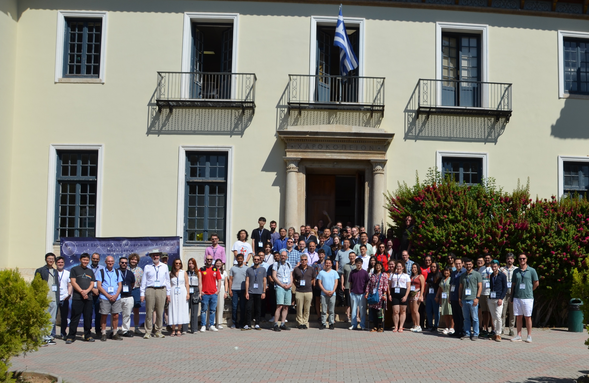

I had the honor of speaking at the [UniversAI: Exploring the Universe with Artificial Intelligence](https://universai2025.hua.gr/) symposium at the Harokopio University of Athens in Greece.

I developed a prototype tool that enables natural language access to the Sloan Digital Sky Survey (SDSS) database. The tool, implemented as a chatbot, takes user queries such as:
“Find AGN galaxies within 0.14 degrees of RA=124.433, DEC=0.801, with u-band magnitude greater than 17.03 and u-band extinction greater than 16.71,”
and translates them into valid SQL queries compatible with SDSS SkyServer and API endpoints.

To build this system, I fine-tuned the lightweight Microsoft Phi-2 transformer model using over 2,000 training examples with the LoRA method. Despite the model's compact size, the fine-tuned version achieves 94% syntactic accuracy and 70% semantic accuracy in generating correct SQL queries.

The motivation behind this project was to make astronomical data more accessible, particularly for users without programming or SQL expertise, by allowing intuitive, natural language interaction with large datasets. The conference was also an excellent opportunity to learn about various ways in which AI is being used in the field of Astronomy.

Conference photo:

