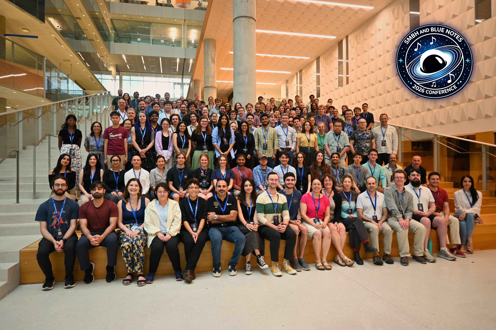

I attended the [**"SMBH and Blue Notes"**](https://sites.google.com/view/smbh2026/) conference in June–July 2026. The conference brought together experts working on a wide range of topics, including time-domain astronomy of AGN, the high-redshift Universe, AGN feedback in galaxy groups and clusters, numerical simulations, theory, observations, instrumentation, and members of the Event Horizon Telescope (EHT) Collaboration.

I presented a poster on my recent paper studying the ionized gas filaments in NGC 5044 and comparing them with filaments in cluster environments. It was a great opportunity to discuss my work with researchers from around the world, learn about the latest developments in the field, and have many interesting scientific discussions that gave me new ideas and perspectives.

The conference was well organized and took place in the beautiful city of Montreal during the annual Jazz Festival and Canada Day celebrations, making it a memorable experience both scientifically and personally. I would like to thank the organizers for putting together such an excellent conference.

See the conference photo and my poster below:

My poster:

Conference Photo:

